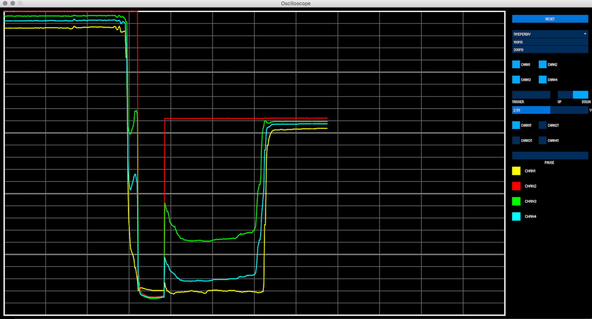

# arduino-oscilloscope

arduino-oscilloscope let you use your arduino as a small oscilloscope by using the analog pins. 

## Pre-required 
The [Arduino IDE](https://www.arduino.cc/en/Main/Software), to load a program in an Arduino board.

[Processing](https://processing.org/download/), a Java-based language and software that allow easy graphic programming.

## Launching the program
The program is very simple to launch. There is only two files. 

`signal_acquisition.ino` is the program that should go on the Arduino. Open it with the Arduino IDE and load it on the card.

`Oscilloscope/oscilloscope.pde` is the program you should use with Processing.

Please note that you should select the right serial port. Look for the `[EDIT]` tag in the setup function for more details.

## How to plug the Arduino
Connect a GND pin to the ground on your circuit. Use the A0 to A3 pins to measure your signals. These pins can only measure values between 0 and 5V.

## How to use the Oscilloscope

**Reset** : Clear the screen and put the cursor at the start of the screen.

**TimePerDiv** : Choose the time resolution of the oscilloscope.

**Channels Selectors** : Choose which channel you want to display.

**Trigger** : Clear the screen and start displaying when the oscillogram crosses the threshold going up (down) when the up (down) mode is selected. You can change the threshold by clicking on the slider. You can also change which channel is triggering.

**Pause** : Freeze the display. The oscillogram won't clear the screen when it should have reached the end of the screen. Useful to take a closer look at what just happened.

   

I have only tried it on macOS since it's the only OS that I have at my disposition at the moment. I will definitively try it on Linux and Windows when I get the chance.

Older version [here](http://achntrl.com/2016/04/05/build_an_oscilloscope_with_an_arduino/).

Feel free to reach out for any information and/or comment.